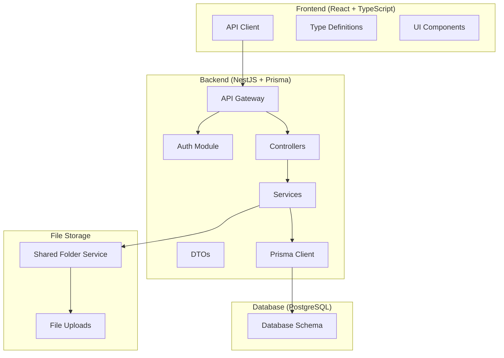

# Design Document

## Overview

이 설계는 현재 프론트엔드(React + TypeScript)와 백엔드(NestJS + Prisma) 간의 API 불일치를 해결하고, 완전한 동기화를 달성하기 위한 포괄적인 백엔드 재구축 방안을 제시합니다. 품질관리 시스템의 핵심 기능인 검사 생성, 조회, 수정을 중심으로 프론트엔드 요구사항에 완벽히 부합하는 API 아키텍처를 구현합니다.

## Architecture

### 전체 시스템 아키텍처



### API 레이어 구조 (프론트엔드 UI 요구사항 기반)

**설계 근거**: 프론트엔드 UI 컴포넌트와 비즈니스 로직 분석을 통해 실제 필요한 API 구조를 설계했습니다.

#### 프론트엔드 UI 분석 결과:

1. **BasicInfoForm 컴포넌트 요구사항**:
   - 발주번호 입력 → 주문 정보 자동 조회 필요
   - `T00000-1` 형식의 발주번호로 주문 정보(발주처, 제품명, 부속명, 사양, 담당자) 조회

2. **InspectionCreatePage 요구사항**:
   - 검사 유형별 탭 (수입/공정/출하)
   - 최근 검사 기록 조회 (필터링: 주문번호, 제품명, 부속명, 검사유형)
   - 검사 생성 후 저장

3. **검사별 Form 컴포넌트 요구사항**:
   - 수입검사: 기본 정보 + 불량 데이터 + 첨부파일
   - 공정검사: 기본 정보 + 공정별 라운드 + 도장 정보 + 불량 데이터 + 첨부파일  
   - 출하검사: 기본 정보 + 작업자별 라운드 + 불량 데이터 + 첨부파일

4. **DefectTypeSelector 요구사항**:
   - 불량 유형 목록 조회
   - 사전 정의 불량 유형 + 커스텀 불량 유형 지원

#### 필요한 API 엔드포인트 구조:

```mermaid
graph TB
    subgraph "Frontend UI Components"
        BASIC_FORM[BasicInfoForm<br/>발주번호 → 주문정보]
        INSPECTION_CREATE[InspectionCreatePage<br/>검사 생성 + 최근 이력]
        DEFECT_SELECTOR[DefectTypeSelector<br/>불량 유형 관리]
        INSPECTION_FORMS[InspectionForms<br/>검사별 특화 입력]
    end
    
    subgraph "Required API Endpoints"
        ORDER_API[/orders/*<br/>주문 정보 조회]
        INSPECTION_API[/inspections/*<br/>검사 CRUD + 이력]
        DEFECT_API[/defect-types/*<br/>불량 유형 관리]
        UPLOAD_API[/uploads/*<br/>파일 업로드]
    end
    
    BASIC_FORM --> ORDER_API
    INSPECTION_CREATE --> INSPECTION_API
    DEFECT_SELECTOR --> DEFECT_API
    INSPECTION_FORMS --> INSPECTION_API
    INSPECTION_FORMS --> UPLOAD_API
```

#### 실제 필요한 API 엔드포인트:

1. **주문 정보 API** (`/orders`)
   ```
   GET /orders/search?orderNumbers=T00000-1,T00000-2
   → 발주번호로 주문 정보 일괄 조회
   ```

2. **검사 API** (`/inspections`)
   ```
   GET /inspections/recent?orderNumber=&productName=&partName=&type=incoming&limit=10
   → 최근 검사 이력 조회 (필터링)
   
   POST /inspections/incoming (multipart/form-data)
   → 수입검사 생성
   
   POST /inspections/process (multipart/form-data)  
   → 공정검사 생성
   
   POST /inspections/shipment (multipart/form-data)
   → 출하검사 생성
   
   GET /inspections/:id
   → 검사 상세 조회
   
   PUT /inspections/:id
   → 검사 수정
   ```


4. **불량 유형 API** (`/defect-types`)
   ```
   GET /defect-types
   → 불량 유형 목록 조회
   
   POST /defect-types
   → 새 불량 유형 생성
   ```

5. **파일 업로드 API** (`/uploads`)
   ```
   POST /uploads/images
   → 이미지 업로드
   
   GET /uploads/images/:inspectionId
   → 검사별 이미지 조회
   ```

**설계 원칙**:
- UI 컴포넌트의 실제 데이터 요구사항 기반
- RESTful API 설계 원칙 준수
- 검사 유형별 특화 데이터 구조 지원
- 파일 업로드와 JSON 데이터 동시 처리
- 효율적인 데이터 조회를 위한 필터링 지원

## Components and Interfaces

### 1. 데이터베이스 스키마 개선

#### 현재 문제점: 배치 중심 구조 vs 프론트엔드 직접 검사 구조

**현재 백엔드 구조**:
```prisma
// 현재: 배치 필수 구조
model IncomingInspection {
  id            Int      @id @default(autoincrement())
  batchId       Int      @unique  // 필수 배치 연결
  batch         InspectionBatch @relation(fields: [batchId], references: [id])
  // ... 기타 필드
}
```

**프론트엔드 요구사항**: 발주번호 → 주문정보 → 검사생성 (배치 개념 없음)

#### 전체 데이터베이스 스키마 구조

**유지되는 스키마 (수정 없음)**:
- DefectType, QualityHistory, InspectionBatch, ExcelOrder, Attachment, UploadLog
- 모든 Enum 타입들 (UserRole, InspectionStatus, InspectionDraftStatus, InspectionType)
- 기존 관계형 구조 유지 (호환성 보장)

**수정되는 스키마**:
```prisma
// User 모델 확장
model User {
  id              Int       @id @default(autoincrement())
  username        String    @unique
  password        String
  Name        String
  role            UserRole  @default(operator)
  isActive        Boolean   @default(true)
  // 새로 추가되는 필드들
  inspectionType  String?   // 'incoming', 'process', 'shipment', 'all'
  processLine     String?   // 공정라인 정보 추가
  authType        String?   @default("local") // 'local', 'oauth'
  lastLoginAt     DateTime?
  createdAt       DateTime  @default(now())
  updatedAt       DateTime  @updatedAt
}

// 검사 모델들 - 주문 정보 직접 포함, 배치 제거
model IncomingInspection {
  id              Int      @id @default(autoincrement())
  
  // 주문 정보 직접 포함 (프론트엔드 요구사항)
  orderNumbers    String[] // 발주번호 배열 (예: ["T00000-1", "T00000-2"])
  client          String?  // 발주처
  productName     String?  // 제품명
  partName        String?  // 부속명
  specification   String?  // 사양
  manager         String?  // 담당자
  
  inspectionDate  DateTime
  totalQty        Int
  defectQty       Int
  notes           String?
  status          InspectionDraftStatus @default(draft)
  defects         IncomingInspectionDefect[]
  attachments     Attachment[]
  createdAt       DateTime @default(now())
  updatedAt       DateTime @updatedAt
}

// ProcessInspection, ShipmentInspection도 동일한 패턴으로 수정
```

#### 해결 방안: 배치 없이 직접 검사 생성

```typescript
// 배치 자동 생성/조회 로직 제거
@Injectable()
export class IncomingInspectionService {
  async create(dto: CreateIncomingInspectionDto) {
    // 배치 없이 직접 검사 생성
    const inspection = await this.prisma.incomingInspection.create({
      data: {
        // 주문 정보 직접 저장
        orderNumbers: dto.orderNumbers,
        client: dto.client,
        productName: dto.productName,
        partName: dto.partName,
        specification: dto.specification,
        manager: dto.manager,
        // 검사 데이터
        inspectionDate: new Date(dto.inspectionDate),
        totalQty: dto.totalQty,
        defectQty: dto.defectQty,
        notes: dto.notes,
        defects: {
          create: dto.defects
        }
      }
    });
    
    return inspection;
  }
}
```

### 2. API 엔드포인트 재설계

#### 인증 API (`/auth`)
```typescript
POST   /auth/login          // 로그인
POST   /auth/register       // 회원가입
GET    /auth/me            // 현재 사용자 정보
POST   /auth/refresh       // 토큰 갱신
POST   /auth/logout        // 로그아웃
```

#### 검사 통합 API (`/inspections`)
```typescript
GET    /inspections/recent                    // 최근 검사 기록 (필터링 지원)
GET    /inspections/references               // 검사 참고 이력
GET    /inspections/statistics              // 검사 통계
```

#### 주문 정보 API (`/orders`)
```typescript
GET    /orders/search?orderNumbers=T00000-1,T00000-2    // 발주번호로 주문 정보 조회
```

#### 검사 API (`/inspections`)
```typescript
GET    /inspections/recent?orderNumber=&productName=&partName=&type=incoming&limit=10
       // 최근 검사 이력 조회 (필터링)

POST   /inspections/incoming                // 수입검사 생성 (multipart/form-data)
POST   /inspections/process                 // 공정검사 생성 (multipart/form-data)  
POST   /inspections/shipment                // 출하검사 생성 (multipart/form-data)

GET    /inspections/:id                     // 검사 상세 조회
PUT    /inspections/:id                     // 검사 수정
DELETE /inspections/:id                     // 검사 삭제
```

#### 불량 유형 API (`/defect-types`)
```typescript
GET    /defect-types                        // 전체 조회
POST   /defect-types                        // 생성
PUT    /defect-types/:id                    // 수정
DELETE /defect-types/:id                    // 삭제
```

### 3. DTO 구조 표준화

#### 공통 응답 구조
```typescript
interface ApiResponse<T> {
  data: T;
  message?: string;
  success: boolean;
  timestamp: string;
}

interface PaginatedResponse<T> {
  data: T[];
  total: number;
  page: number;
  limit: number;
  totalPages: number;
}

interface ErrorResponse {
  error: {
    code: string;
    message: string;
    details?: any;
  };
  success: false;
  timestamp: string;
}
```

#### 검사 생성 DTO 표준화
```typescript
// 수입검사 DTO
class CreateIncomingInspectionDto {
  batchId: number;
  inspectionDate: string;
  totalQty: number;
  defectQty: number;
  notes?: string;
  defects: IncomingInspectionDefectDto[];
  attachments?: Express.Multer.File[];
}

// 공정검사 DTO (추가 필드 포함)
class CreateProcessInspectionDto extends CreateIncomingInspectionDto {
  paintPrimer?: string;
  paintTopcoat?: string;
  line?: string;
  subLine?: string;
  peelingTest?: string;
  colorDiff?: string;
  extraWork?: string;
  lineSpeed?: string;
  spindleRatio?: string;
  uvCond?: string;
  irCond?: string;
  jig?: string;
  injectionPack?: string;
  afterPack?: string;
  rounds: ProcessInspectionRoundDto[];
}

// 출하검사 DTO (복잡한 구조)
class CreateShipmentInspectionDto extends CreateIncomingInspectionDto {
  finalPeeling?: string;
  externalCheck?: boolean;
  rounds: ShipmentInspectionRoundDto[];
}
```

### 4. 서비스 레이어 재구축

#### 공통 서비스 패턴
```typescript
@Injectable()
export class BaseInspectionService<T, CreateDto, UpdateDto> {
  constructor(protected prisma: PrismaService) {}
  
  async create(dto: CreateDto): Promise<T> {
    // 공통 생성 로직
  }
  
  async findByBatchId(batchId: number): Promise<T | null> {
    // 공통 배치 조회 로직
  }
  
  async getReferences(params: ReferenceParams): Promise<T[]> {
    // 공통 참고 이력 조회 로직
  }
}
```

#### 검사별 특화 서비스
```typescript
@Injectable()
export class IncomingInspectionService extends BaseInspectionService {
  async create(dto: CreateIncomingInspectionDto) {
    // 수입검사 특화 로직
    // - 파일 업로드 처리
    // - 불량 데이터 생성
    // - 배치 연결
  }
  
  async getReferences(params: ReferenceParams) {
    // QualityHistory를 통한 관련 검사 이력 조회
    return this.prisma.incomingInspection.findMany({
      where: {
        batch: {
          qualityHistory: {
            OR: [
              { mainOrderNumber: { contains: params.orderNumber } },
              { mainProductName: { contains: params.productName } },
              { mainPartName: { contains: params.partName } }
            ]
          }
        }
      },
      include: {
        defects: { include: { defectType: true } },
        batch: { include: { qualityHistory: true } }
      },
      orderBy: { inspectionDate: 'desc' },
      take: 10
    });
  }
}
```

## Data Models

### 프론트엔드-백엔드 타입 매핑

#### 사용자 타입
```typescript
// Frontend Type
interface User {
  id: number;
  username: string;
  email: string;
  fullName: string;
  role: UserRole;
  isActive: boolean;
  phoneNumber?: string;
  department?: string;
  authType?: 'local' | 'oauth';
  inspectionType?: 'incoming' | 'process' | 'shipment' | 'all';
  createdAt: string;
  updatedAt: string;
}

// Backend DTO
class UserResponseDto {
  @Expose()
  id: number;
  
  @Expose()
  username: string;
  
  @Expose()
  email: string;
  
  @Expose()
  fullName: string;
  
  @Expose()
  role: UserRole;
  
  @Expose()
  isActive: boolean;
  
  @Expose()
  phoneNumber?: string;
  
  @Expose()
  department?: string;
  
  @Expose()
  authType?: string;
  
  @Expose()
  inspectionType?: string;
  
  @Expose()
  createdAt: Date;
  
  @Expose()
  updatedAt: Date;
}
```

#### 검사 데이터 타입
```typescript
// Frontend - 수입검사 생성 요청
interface CreateIncomingInspectionDto {
  batchId: number;
  inspectionDate: string;
  totalQty: number;
  defectQty: number;
  notes?: string;
  defects: {
    defectTypeId?: number;
    customType?: string;
    count: number;
    details?: any;
  }[];
  attachments?: {
    file: File;
  }[];
}

// Backend - 수입검사 응답
class IncomingInspectionResponseDto {
  @Expose()
  id: number;
  
  @Expose()
  batchId: number;
  
  @Expose()
  inspectionDate: Date;
  
  @Expose()
  totalQty: number;
  
  @Expose()
  defectQty: number;
  
  @Expose()
  notes?: string;
  
  @Expose()
  status: InspectionDraftStatus;
  
  @Expose()
  @Type(() => IncomingInspectionDefectResponseDto)
  defects: IncomingInspectionDefectResponseDto[];
  
  @Expose()
  @Type(() => AttachmentResponseDto)
  attachments: AttachmentResponseDto[];
  
  @Expose()
  @Type(() => InspectionBatchResponseDto)
  batch: InspectionBatchResponseDto;
  
  @Expose()
  createdAt: Date;
  
  @Expose()
  updatedAt: Date;
}
```

## Error Handling

### 표준화된 에러 응답 구조

```typescript
class ApiErrorResponse {
  success: false;
  error: {
    code: string;           // 'VALIDATION_ERROR', 'NOT_FOUND', 'UNAUTHORIZED' 등
    message: string;        // 사용자 친화적 메시지
    details?: any;          // 상세 에러 정보 (개발용)
    field?: string;         // 필드별 에러인 경우
  };
  timestamp: string;
}
```

### 에러 처리 전략

1. **Validation Errors**: class-validator를 통한 일관된 검증
2. **Business Logic Errors**: 커스텀 예외 클래스 사용
3. **Database Errors**: Prisma 에러를 사용자 친화적 메시지로 변환
4. **File Upload Errors**: 파일 크기, 형식 등에 대한 명확한 에러 메시지

```typescript
@Catch()
export class GlobalExceptionFilter implements ExceptionFilter {
  catch(exception: unknown, host: ArgumentsHost) {
    const ctx = host.switchToHttp();
    const response = ctx.getResponse<Response>();
    
    let status = HttpStatus.INTERNAL_SERVER_ERROR;
    let errorResponse: ApiErrorResponse;
    
    if (exception instanceof ValidationException) {
      status = HttpStatus.BAD_REQUEST;
      errorResponse = {
        success: false,
        error: {
          code: 'VALIDATION_ERROR',
          message: '입력 데이터가 올바르지 않습니다.',
          details: exception.getValidationErrors()
        },
        timestamp: new Date().toISOString()
      };
    }
    // ... 다른 에러 타입 처리
    
    response.status(status).json(errorResponse);
  }
}
```

## Testing Strategy

### 1. 단위 테스트 (Unit Tests)

#### 서비스 레이어 테스트
```typescript
describe('IncomingInspectionService', () => {
  let service: IncomingInspectionService;
  let prisma: PrismaService;
  
  beforeEach(async () => {
    const module = await Test.createTestingModule({
      providers: [
        IncomingInspectionService,
        {
          provide: PrismaService,
          useValue: mockPrismaService
        }
      ]
    }).compile();
    
    service = module.get<IncomingInspectionService>(IncomingInspectionService);
    prisma = module.get<PrismaService>(PrismaService);
  });
  
  describe('create', () => {
    it('should create incoming inspection with defects', async () => {
      // 테스트 구현
    });
    
    it('should handle file uploads correctly', async () => {
      // 파일 업로드 테스트
    });
  });
});
```

#### DTO 검증 테스트
```typescript
describe('CreateIncomingInspectionDto', () => {
  it('should validate required fields', () => {
    const dto = new CreateIncomingInspectionDto();
    const errors = validate(dto);
    expect(errors).toHaveLength(4); // batchId, inspectionDate, totalQty, defectQty
  });
  
  it('should validate defects array', () => {
    // defects 배열 검증 테스트
  });
});
```

### 2. 통합 테스트 (Integration Tests)

#### API 엔드포인트 테스트
```typescript
describe('IncomingInspectionController (e2e)', () => {
  let app: INestApplication;
  let prisma: PrismaService;
  
  beforeEach(async () => {
    const moduleFixture = await Test.createTestingModule({
      imports: [AppModule]
    }).compile();
    
    app = moduleFixture.createNestApplication();
    prisma = app.get<PrismaService>(PrismaService);
    await app.init();
  });
  
  describe('POST /incoming-inspections', () => {
    it('should create inspection with multipart data', () => {
      return request(app.getHttpServer())
        .post('/incoming-inspections')
        .field('data', JSON.stringify(mockInspectionData))
        .attach('attachments', 'test-file.jpg')
        .expect(201)
        .expect((res) => {
          expect(res.body.data.id).toBeDefined();
          expect(res.body.data.defects).toHaveLength(2);
        });
    });
  });
});
```

### 3. 프론트엔드-백엔드 계약 테스트

#### API 계약 검증
```typescript
describe('API Contract Tests', () => {
  it('should match frontend CreateIncomingInspectionDto with backend', () => {
    const frontendDto: CreateIncomingInspectionDto = {
      batchId: 1,
      inspectionDate: '2024-01-15',
      totalQty: 100,
      defectQty: 5,
      defects: [
        { defectTypeId: 1, count: 3 },
        { customType: '기타 불량', count: 2 }
      ]
    };
    
    // 백엔드 DTO로 변환 및 검증
    const backendDto = plainToClass(CreateIncomingInspectionDto, frontendDto);
    const errors = validateSync(backendDto);
    expect(errors).toHaveLength(0);
  });
});
```

### 4. 성능 테스트

#### 데이터베이스 쿼리 최적화 테스트
```typescript
describe('Performance Tests', () => {
  it('should load inspection references efficiently', async () => {
    const startTime = Date.now();
    const references = await service.getReferences({
      orderNumber: 'T12345-6',
      productName: '120ML원형',
      partName: '본체'
    });
    const endTime = Date.now();
    
    expect(endTime - startTime).toBeLessThan(1000); // 1초 이내
    expect(references).toHaveLength(10); // 최대 10개 결과
  });
});
```

이 설계는 프론트엔드와 백엔드 간의 완전한 API 동기화를 달성하고, 향후 동시 개발이 원활하게 진행될 수 있는 견고한 기반을 제공합니다.